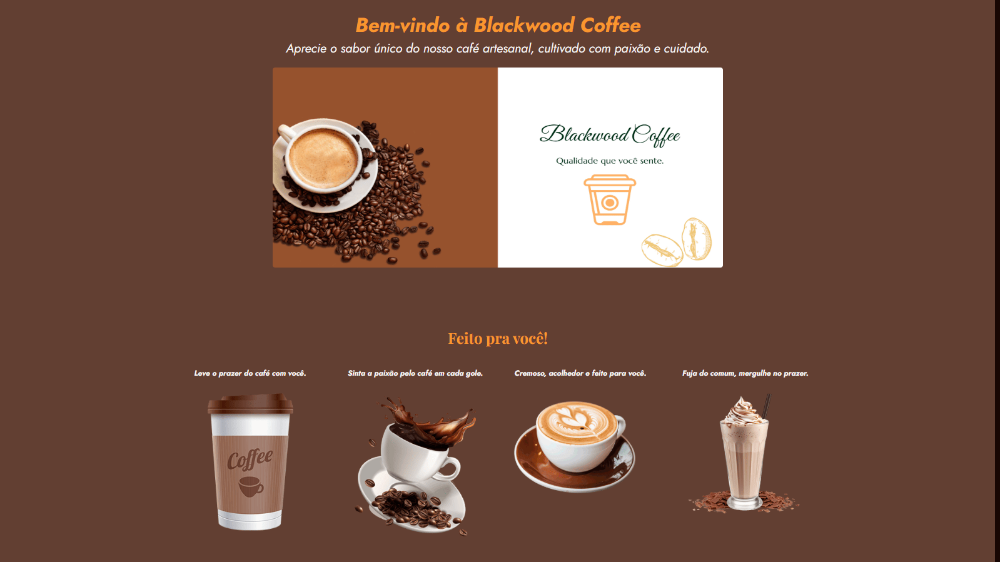

<h1 align="center">☕ Blackwood Coffee — Site Institucional Premium</h1>

<p align="center">
  O <strong>Blackwood Coffee</strong> é um site institucional completo para uma cafeteria premium. O foco do desenvolvimento foi criar uma interface de alta fidelidade visual (Pixel Perfect) com uma navegação fluida e sem dependências de frameworks pesados.
</p>

<p align="center">
  Este projeto foi totalmente desenvolvido por mim, <strong>Jean Pedro</strong>.
</p>

<p align="center">
  
</p>

<p align="center">
  <a href="https://jjeanpedro03.github.io/Blackwood-Coffee/" target="_blank">
    
  </a>
</p>

## 🎯 Objetivo

Este projeto foi desenvolvido com o objetivo de praticar a construção de interfaces modernas, responsivas e com alta fidelidade visual, simulando um site institucional real para uma cafeteria premium.

## 🚀 Sobre o Projeto

Interface moderna e sofisticada que simula a experiência digital de uma cafeteria de alto padrão. O projeto prioriza performance, organização de código e experiência do usuário.

- 📱 Interface moderna e totalmente responsiva  
- 📅 Sistema de reservas funcional  
- ✉️ Integração com formulário (Formspree)  
- ⚡ Carregamento otimizado com foco em UX  

## 🛠️ Tecnologias Utilizadas

<p align="left">
  
</p>

- **HTML5:** Estrutura semântica e organizada  
- **CSS3:** Estilização modular e responsiva  
- **JavaScript (Vanilla):** Interatividade e validação de dados  
- **Figma:** Protótipo e design da interface  
- **Git:** Versionamento do projeto  

## ⚙️ Funcionalidades

- **Navegação Completa:** Transição entre Home, Produtos, Sobre, Reservas e Contato  
- **Validação de Dados:** Sistema de reserva com tratamento de inputs via JavaScript  
- **Layout Adaptável:** Experiência consistente em dispositivos mobile e desktop  
- **Feedback de Usuário:** Página de sucesso personalizada após envio de formulários  

## 💡 Diferenciais Técnicos

- **Estrutura Modular de CSS:** Separação por páginas para evitar conflitos de estilo  
- **JavaScript Vanilla:** Manipulação direta do DOM para maior leveza e controle  
- **Foco em Escalabilidade:** Organização de diretórios que facilita a adição de novas páginas  
- **Pixel Perfect:** Fidelidade ao design proposto, garantindo consistência visual  

## 📂 Estrutura de Pastas

```text
├── CSS/
│   ├── global.css
│   ├── style.css
│   ├── uni01.css
│   └── [páginas].css
├── HTML/
│   ├── Contato.html
│   ├── Nossos Produtos.html
│   ├── Reservas.html
│   ├── Sobre nos.html
│   └── sucesso.html
├── JS/
│   └── scripts.js
├── img/
└── index.html
