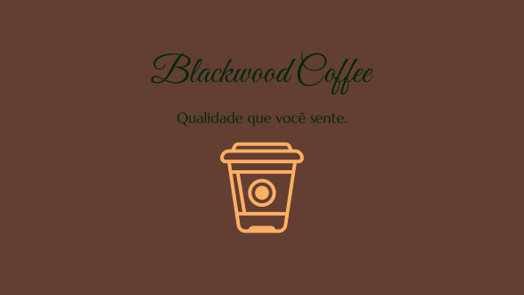

<h1 align="center">☕ Blackwood Coffee</h1>

<p align="center">
  Uma experiência premium de cafeteria digital, com design sofisticado e sistema de reservas.
</p>

<p align="center">
  
</p>

## 🚀 Sobre o Projeto

O **Blackwood Coffee** é um site institucional completo para uma cafeteria premium...

- Interface moderna e responsiva  
- Sistema de reservas  
- Integração com formulário  
- Experiência focada no usuário  

<p align="center">
  
  
  
  
</p>

<p align="center">
  <a href="https://jjeanpedro03.github.io/Blackwood-Coffee/" target="_blank">
    
  </a>
</p>

## 🎥 Demonstração


## 📂 Estrutura de Pastas
```text
├── CSS/
│   ├── global.css          # Reset, variáveis e componentes globais (Nav/Footer)
│   ├── style.css           # Estilos base da estrutura
│   ├── uni01.css           # Estilização exclusiva da Home
│   └── [páginas].css       # Estilos específicos para cada seção
├── HTML/
│   ├── Contato.html        # Página de suporte e dúvidas
│   ├── Nossos Produtos.html # Catálogo visual de produtos
│   ├── Reservas.html       # Sistema de agendamento
│   ├── Sobre nos.html      # Institucional e história
│   └── sucesso.html        # Feedback visual de envio concluído
├── JS/
│   └── scripts.js          # Lógica de interatividade e validações
├── img/                    # Assets visuais (Logotipos, Banners e Cards)
└── index.html              # Ponto de entrada principal

---

<p align="center">
  Feito por Jean Pedro 🚀
</p>
